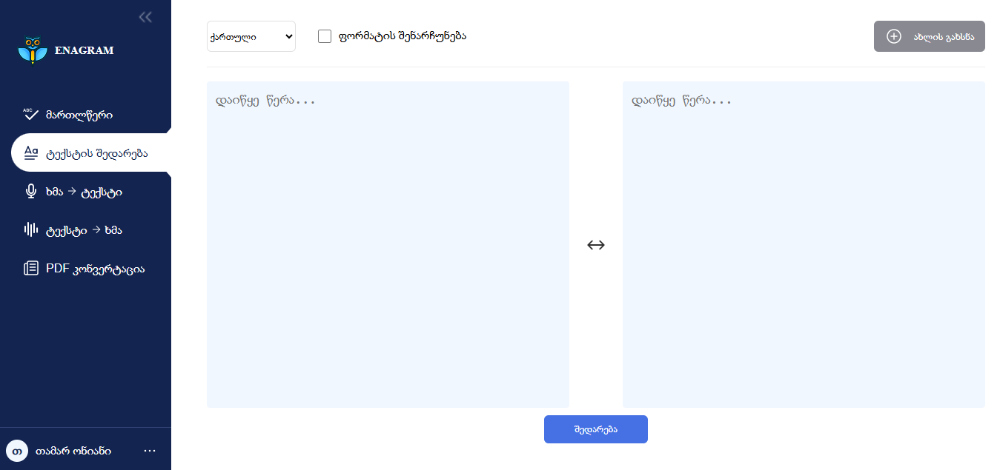
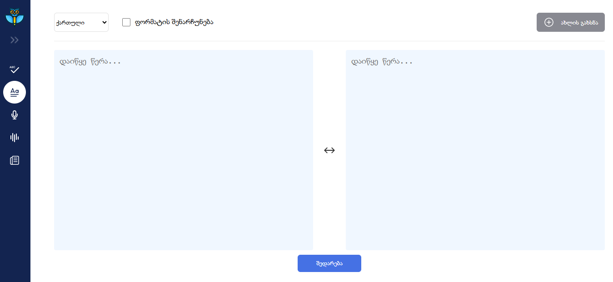
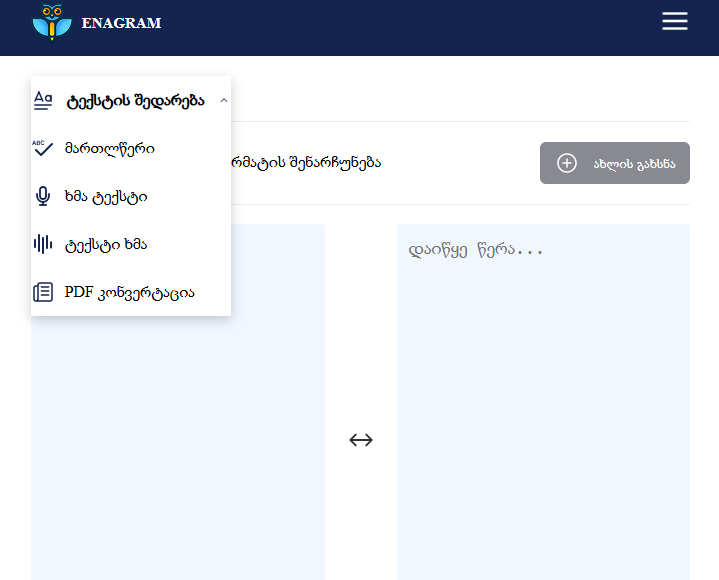

# Text Comparison Web App 🚀

A **responsive web application** built with **React** for comparing text inputs using the **diff** library.

---

## ✨ Features

### Responsive Sidebar 📱

-   Displays as a sidebar on screens larger than 800px, with toggle functionality.
-   Converts to a dropdown menu on screens 800px or smaller for mobile-friendly navigation.

### Text Comparison 📝

-   Uses the **diff library** to compare text inputs and highlight differences.

---

## 🛠️ Tech Stack

-   **React ⚛️**: Frontend framework for building the interactive UI.
-   **diff Library 📚**: Handles text comparison and difference highlighting.
-   **Scss 🎨**: Custom styles for responsive design and layout.

---

## 🖼️ Screenshots / Images

Here are some screenshots of the app:

  
  

